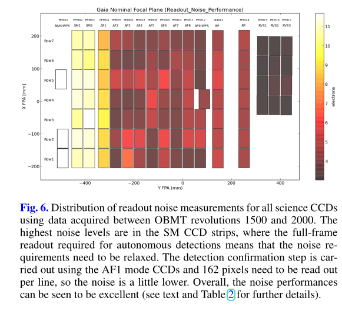

## Noise Implementations

- From `Gaia DR1 - On orbit performance of gaia CCDs`: Noise of 2 prescan pixels follow a normal distribution with μ=11, σ=0.5 (approximately)
- The read out noise is well below specifications, falling at 4.5 e- mean and 0.8 std (what dist? idk) 
